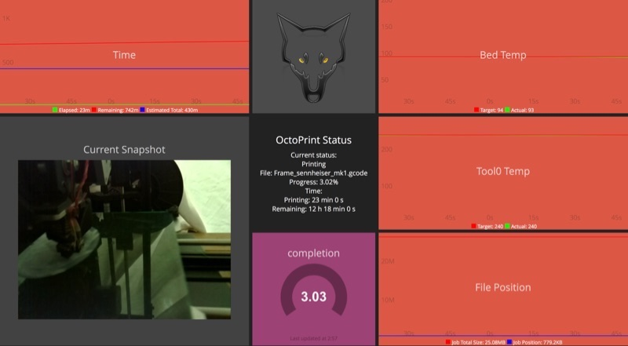

#Dashing-OctoPrint

####A templatized 3D printing dashboard

This aims to be a [Dashing](http://shopify.github.io/dashing/#overview) widget and sample dashboard for viewing metrics and data from your [OctoPrint](http://octoprint.org) rig. This is developed against [OctoPi](https://github.com/guysoft/OctoPi).

##Installation

-	Clone [the repository](https://github.com/wolfspyre/dashing-octoprint)
-	Run the `scripts/deploy.sh` shell script, which will perform the needed actions to install this widget.
      	./scripts/deploy.sh /home/pi/dashing-plugins/dashing-octoprint parent_dir_of_install dashboard_install_dir

-	Restart Dashing to pick up the new changes.
-	Navigate to the newly installed octoprint dashboard in your browser, and revel in the dashboardy goodness of your octoprint rig.

###Required Widgets

The graphs depend on [Jason Walton's Rickshawgraph plugin](https://gist.github.com/jwalton/6614023). The process for installation is pretty straightforward. You should review the installation instructions contained within the repo, as they may supersede these; but this should get you going. There are two ways to do it.

-	Manual Installation

	-	Create a `rickshawgraph` directory in the `widgets` directory of your dashboard installation.
	-	Place the [rickshawgraph.coffee](https://gist.github.com/jwalton/6614023/raw/07c3a382845fbc27e0523d7f2de43e43e0904c4b/rickshawgraph.coffee), [rickshawgraph.html](https://gist.github.com/jwalton/6614023/raw/da626313b868c685e515db19bfd98c68db13d649/rickshawgraph.html), and [rickshawgraph.scss](https://gist.github.com/jwalton/6614023/raw/8d1fbd74b4915b3b96b899b7c723cf078cf53fc9/rickshawgraph.scss) file, the Inside the newly created `widgets\rickshawgraph` directory
	-	Restart Dashing.

-	Automatic Installation

	-	from within your dashboard directory; install the gist with the `dashing install` command:
		-	`dashing install 6614023`
	-	Restart Dashing.

---

##Configuration

The `octoprint_defaults.yaml` file tunes the behavior of the job. it is meant to provide you an example configuration of the configurable parameters. You are meant to create an `octoprint_overrides.yaml` file in the `conf.d` directory with your specific settings. This permits you to update the default configuration file automatically, while simultaneously maintaining a custom local configuration.

###Configuration Parameters

* `octo_server_api_job_endpoint`
(**string**) *Default:* `'/api/job'`
  -  The endpoint to query for jobs

* `octo_server_api_key`
(**string**) *Default:* `'CHANGEME'`
	- Your OctoPrint API key.
	- **Currently unnecessary**. May be required in the future.

* `octo_server_api_poll_interval`
(**string**) *Default:* `'30'`
	- How frequently the OctoPrint API should be polled.

* `octo_server_api_port`
(**string**) *Default:* `'443'`
	- The port the OctoPrint API is listening on

* `octo_server_api_printer_endpoint`
(**string**) *Default:* `'/api/printer'`
	- The OctoPrint API printer endpoint

* `octo_server_api_ssl`
(**boolean**) *Default:* true
	- Whether to enable SSL when talking to the OctoPrint API

* `octo_server_fqdn`
(**string**) *Default:* `'octoprint.example.com'`
	- The FQDN of your OctoPrint rig.

* `octo_server_graph_depth`
(**string**) *Default:* `'300'`
	- The number of entries to display in the graph

* `octo_server_history_enable`
(**boolean**) *Default:* true
	- Whether or not to store data to a history file to persist data across restarts.

* `octo_server_history_file`
(**string**) *Default:* `'history/octoprint_history.yaml'`
	- The file to store history data in.

* `octo_server_job_graph_enable`
(**boolean**) *Default:* true
	- Enablement toggle for the Octoprint server job

* `octo_server_job_graph_time_units`
(**string**) *Default:* `'minutes'`
	- What units of time to display in the job graph.
	- Supported options: [m, min, minutes, s, sec, seconds]

* `octo_server_job_graph_time_color_elapsed`
(**string**) *Default:* `'#0f0'`
	- The color to use for the time elapsed in the job graph

* `octo_server_job_graph_time_color_estimated`
(**string**) *Default:* `'#00f'`
	- The color to use for the estimated time in the job graph

* `octo_server_job_graph_time_color_remaining`
(**string**) *Default:* `'#f00'`
	- The color to use for the time elapsed in the job graph

* `octo_server_job_graph_file_color_position`
(**string**) *Default:* `'#00f'`
	- The color to use for the file position in the job graph

* `octo_server_job_graph_file_color_total`
(**string**) *Default:* `'#f00'`
	- The color to use for the file total size in the job graph

* `octo_server_completion_fgcolor`
(**string**) *Default:* `'#333'`
	- The foreground color to use for the completion widget

* `octo_server_completion_bgcolor`
(**string**) *Default:* `'#3c3'`
	- The background color to use for the completion widget

* `octo_server_last_filename`
(**string**) *Default:* `'assets/images/octocam/last.jpeg'`
	- The last file saved from the snapshot endpoint.

* `octo_server_latest_filename`
(**string**) *Default:* `'assets/images/octocam/latest.jpeg'`
	- The latest file saved from the snapshot endpoint.

* `octo_server_printer_bed_temp_graph_color_actual`
(**string**) *Default:* `'#00ff00'`
	- The color to graph the actual bed temperature.

* `octo_server_printer_bed_temp_graph_color_background`
(**string**) *Default:* `'#cccccc'`
	- The background color for the bed temperature graph.

* `octo_server_printer_bed_temp_graph_color_target`
(**string**) *Default:* `'#ff0000'`
	- The color to graph the target bed temperature.

* `octo_server_printer_bed_temp_graph_enable`
(**boolean**) *Default:* true
	- Enablement toggle for the bed temperature graph job

* `octo_server_printer_tool_0_temp_graph_color_actual`
(**string**) *Default:* `'#00ff00'`
	- The color to graph the current temperature of tool0.

* `octo_server_printer_tool_0_temp_graph_color_background`
(**string**) *Default:* `'#cccccc'`
	- The background color for the tool0 temperature graph.

* `octo_server_printer_tool_0_temp_graph_color_target`
(**string**) *Default:* `'#ff0000'`
	- The color to graph the target temperature of tool0.

* `octo_server_printer_tool_0_temp_graph_enable`
(**boolean**) *Default:* true
	- Enablement toggle for the tool0 temperature graph job

* `octo_server_printer_tool_1_temp_graph_color_actual`
(**string**) *Default:* `'#00ff00'`
	- The color to graph the current temperature of tool0.

* `octo_server_printer_tool_1_temp_graph_color_target`
(**string**) *Default:* `'#ff0000'`
	- The color to graph the target temperature of tool1.

* `octo_server_printer_tool_1_temp_graph_enable`
(**boolean**) *Default:* false
	- Enablement toggle for the tool1 temperature graph job

* `octo_server_snapshot_url`
(**string**) *Default:* `'https://octoprint.example.com/webcam/?action=snapshot'`
	- The url we should collect the latest snapshot from.

* `octo_server_webcam_poll_interval`
(**string**) *Default:* `'30'
	- How frequently to poll the snapshot URL.

* `octo_server_webcam_port`
(**string**) *Default:* `'443'
	- The tcp port to connect to for the snapshot endpoint

* `octo_server_webcam_ssl`
(**boolean**) *Default:* true
	- Whether or not to connect to the snapshot endpoint via SSL
